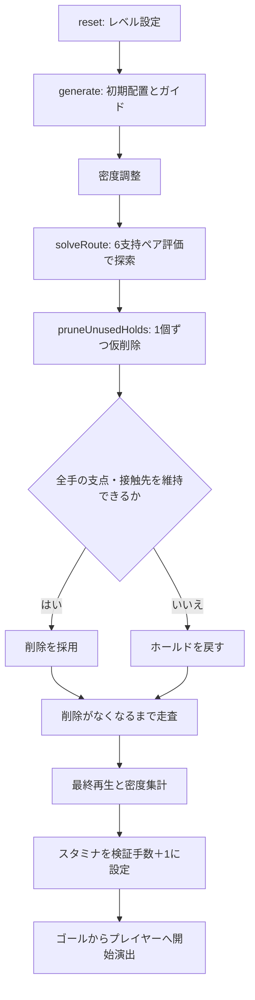

# 現在のコース生成手順

更新日：2026-09-20。2肢固定のみの実装に対応する。旧コース選択、1肢固定の生成、固定パターン検証ステージは削除済み。

## 1. 生成経路

[game.js](../js/game.js) の `reset(n)` から [route.js](../js/route.js) の `prepareStage()` を呼ぶ。モード分岐はない。



初期配置のガイドと、操作ルールで検証済みのルートは別物である。初期ガイドは候補を示すだけで、四肢の移動順を強制しない。

## 2. 初期配置

[stage.js](../js/stage.js) の `createStageGenerator().generate(n)` が担当する。生成器内の状態を使い、完成した値をゲーム本体へ渡す。

### 2.1 レベルと乱数

- `mulberry32(n)` にレベル番号を与え、同じレベルでは同じ乱数列を使う。
- 密度基準が未作成でレベル2以降を直接生成する場合、先にレベル1を生成して密度を測る。
- 基準パスの規模を決める値は、レベル1では5、以降は `20 + min(n - 2, 3) × 2`。
- この値は配置用の規模であり、実際のクリア手数ではない。最終手数は後段の探索で決まる。レベル1も5手に固定されてはいない。

### 2.2 折れ線の基準パス

レベル1は直線。それ以降は `makeCourse()` で垂直上昇と横断を交互につなぐ。角を曲線で丸めない。

| 設定 | 現在値・意味 |
| --- | --- |
| 論理画面 | 幅400px、高さ700px |
| ステージ高上限 | 1400px（2画面） |
| 左右の振れ幅 | 中央から160px、両端間320px |
| 上昇区間 | 290px＋20px未満のシード付き変動 |
| 横断終点 | 始点より20px下方（高さ調整前） |
| パス上の基準間隔 | 弧長40pxごとの位置 |
| パスからのホールド偏位 | 法線方向に左右8px |

Yは下向きが正。横断は水平または下降であり、斜め上の移動とは区別する。高さ上限に合わせて必要な場合はY方向を縮小する。

### 2.3 ホールドとガイド姿勢

1. パス上の配置位置を作る。最初の4個がスタート、最後がゴール。
2. 初期の手足の接触先を設定する。
3. パス上の支持位置を順に入れ替え、胴体中心の参考位置を作る。
4. `fillWall()` で周囲にもホールドを配置する。
5. `convergeDensity()` で密度を調整する。

この段階の `route` は探索のガイドであり、現行の操作でクリアできる手順としてはまだ確定していない。

### 2.4 密度調整

レベル1の最大画面内個数を基準にする。画面高700pxの窓内に含まれる個数と、局所的な空白を評価し、混み合った箇所の追加ホールドを削る。

パス上の配置を保護し、ホールドを減らしても空白が大きくなりすぎないことを条件とする。制約により密度目標へ到達できない場合もあり、その結果は `densityStats.converged` に入る。この密度調整だけではクリア可能性を保証しない。

## 3. 現行操作によるルート探索と再生

[route.js](../js/route.js) の `solveRoute(guide, maxMoves = 40)` が担当する。

- 初期接触先から、ガイド方向の中間点や近傍の胴体位置を候補にする。
- ゲーム本体と同じ `selectAnchor()`、`supportsReachable()`、`attachMoving()` を使う。
- 全四肢が吸着でき、接触位置の集合が変わる移動を採用する。
- 各深さで進行度のよい候補を最大12件残すビーム探索を行う。
- 両手がゴールを共有し、全四肢が吸着した姿勢を終点とする。
- レベル2以降では、水平または下降する横移動を少なくとも1手含むルートを要求する。

得られる手順は、胴体位置、固定支点、四肢のホールドIDを保持する。`anchor` は常に固定する2個の四肢番号の配列になる。

`replayRoute()` は指定した胴体位置の列を通常ルールで再生し、支点・吸着先・勝利を再確認する。探索で解が見つからない場合は生成エラーであり、数学的に解が存在しないことの証明ではない。最短手数も保証しない。

## 4. 支持ペア評価と最終ホールド削減

### 4.1 支持ペアの評価

4肢から固定する2肢を選ぶ組み合わせは6組。初期スワイプ方向について各組を評価する。

1. 両方の支持ホールドを保持したまま、胴体が移動できる距離を調べる。
2. その距離の25%、50%、75%、100%地点で、残る2肢それぞれに前方の新しいホールド候補があるか調べる。
3. 前方候補がある可動肢の数を優先する。
4. 同数なら胴体の移動可能距離が長い支持ペアを選ぶ。

これは完成姿勢の予約ではない。選ぶのは固定ペアだけで、移動中の接触先は自動吸着処理が決める。支持ペアは操作の途中で切り替えない。

### 4.2 探索後の逐次削減

新方式では、実際には掴まないホールドも、前方候補の評価を通じて支点選択に影響する。このため「未使用なら一括削除」は行わない。

`pruneUnusedHolds()` は次の手順で削減する。

1. 開始姿勢と全ルートの接触先を保護する。
2. 未使用の通常ホールドを1個だけ仮に削除する。
3. 全ルートを再生する。
4. `samePairRoute()` で、手順数・各手の支点ペア・四肢の接触先が一致することを確認する。
5. 一致すれば削除を確定し、一致しなければホールドを戻す。
6. 一巡で削除があれば再度走査し、削除できなくなるまで続ける。
7. 最終配置で全ルートを再検証する。

後の削除によって、以前は必要だったホールドが不要になる場合もあるため再走査する。採用のたびに個数が減るので反復は有限。削除順に依存する貪欲な処理であり、全組み合わせに対する最小ホールド数は保証しない。

この工程で新たな飾りや偽分岐は追加しない。最後に残ったルート外ホールドは、現在の手順・支点選択を保つために削除できなかったものとして `densityStats.selectionHoldIds` に記録する。

## 5. 結果と保証範囲

| 値 | 意味 |
| --- | --- |
| `holds` | 最終ホールド一覧 |
| `route` | 胴体位置、固定する2肢、4接触先を持つ検証ルート |
| `initialGrips` | 開始時の接触先 |
| `HEIGHT` | 壁の高さ（最大1400px） |
| `densityStats.selectionHoldIds` | 支点選択維持のため残したルート未使用ホールド |
| `densityStats.routeRemoved` | ルート探索後に削減した個数 |
| `densityStats.peak` | 最終配置の最大画面内個数 |

`samePairRoute()` は接触先だけでなく、固定するペアと手順数の一致を確認する。新たな飾りや偽分岐を戻す工程はない。失敗を1肢固定への切り替えで回避する処理もない。

```sh
node tests/routes.cjs
```

20レベルの実入力クリア、操作中の2点固定、生成時と操作時の支点一致、残した評価用ホールドの必要性を検証する。有限候補の探索であり、最短手数、最小ホールド数、あらゆるレベルの生成成功を数学的に保証するものではない。

## 固定長ポーズに対応する足の条件

両コースで、足先は胴体中点以下、股関節より高い足は膝内角150度以上を条件とする。開始時の両足は股関節より下に置く。吸着・支持ペア選択・探索・再生には共通の到達判定を使う。固定足の可動域は非凸になるため、各手の終点だけでなく、開始点から最初の不成立境界までの移動区間を検証する。未使用ホールドの削減後にも同じ再生条件を適用する。
